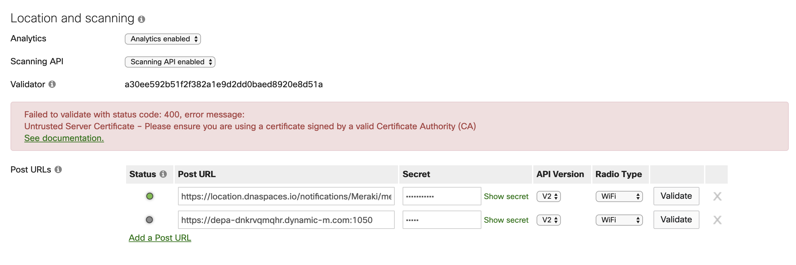

# Gathering & Analysing data from the Meraki Scanning API
## Introduction
The objetive of this Repository is to offer a easy way to recolect and analyse data from the Meraki scanning API using a Raspberry Pi

## Technologies used
- Meraki AP
- Meraki Scanning API
- Flask
- PostgresSQL
- Nginix
- Certbot (Letsencrypt)
- Grafana
- Docker
- Docker Compose
- Raspberry Pi


## Pre-requisites 

- Raspberry Pi 
- Debian Based OS installed in the Pi (Raspian is OK)
- Docker  installed in the Pi
- Docker-compose  installed in the Pi
- Editing access to a Organization in the Meraki Dashboard with APs up & running 
- Ports 80 & 443 of the Rapsberry Pi exposed to the internet 

---
 

The port 80 is used to respond to challenges, used by the letsencrypt bot.
this is only used during first request  and the renewal of the cert 

---

 

Exposing the ports in the Pi can be achived by using the home router of any ISP and/or a meraki MX

---

<details><summary><b>How to install Docker</b></summary>

<p>Follows the steps detailed in the following link:
</p>

[Install Docker](https://docs.docker.com/engine/install/debian/#install-using-the-convenience-script)

</details>

<details><summary><b>How to install Docker-compose</b></summary>
<p>Follows the steps detailed in the following link:
</p>

[Install Docker Compose](https://docs.docker.com/compose/install/)
</details>

## How to Install

### Enable the Scanning API and retrive the validator 

Follow the steps the link below:

[Enable scanning API](https://developer.cisco.com/meraki/scanning-api/#!enable-scanning-api) 

- - - 

 

**NOTE** The *URL* to be configured in the Dashboard must be rechable via Internet and must publish the port 443 of the Raspberry Pi 

- - - 
After enabling the scanning API make sure to copy the validator somewere safe. 


### Clone this repo in the Raspberry Pi & checkout to the branch **arm**
``` bash
git clone https://github.com/uriarriaga/merakiApiScanning.git
```
Enter the local Repository and change to the **arm** Branch
``` bash 
cd merakiApiScanning/
git checkout arm
```
### Create the varibles.env file and set enviromental varibles for the containers 

``` bash
sudo nano varibles.env
```
This is an example of the contents of the file.
```bash
MERAKI_VALIDATOR=abcdefghijklmnopqrstuvxyz
POSTGRES_USER=user
POSTGRES_PASSWORD=password # !!CHANGE ME!! 
POSTGRES_DB=database
POSTGRES_HOST=postgres-app
```
- - -


**NOTE** All the values should be changed exept for the `POSTGRES_HOST` this value is linked to the alias of the postgres container in the `docker-compose.yml`

- - -

Please Change the values as you please acording to your context.

### Generate the Certs to be used by nginx

<br>First you need to modifi the file `cerbot.sh` located in the directory `.../merakiScanningAPI`. The changes that you must make are in the last 2 lines(email & URL) 
```
sudo nano certbot.sh
```
```
sudo docker run -it --rm -p 80:80 --name certbot \
                -v ./certs/etc/letsencrypt:/etc/letsencrypt \
                -v ./certs/var/lib/letsencrypt:/var/lib/letsencrypt  \
                certbot/certbot:arm32v6-nightly certonly  \
                --standalone  --agree-tos --no-eff-email \
                --email <email> \
                -d <URL>
```
Update the `default.conf` used by Nginix. The file is located in the directory 
`.../merakiScanningAPI/nginx/`

``` bash
cd nginx
sudo nano default.conf
```
In the file you must change  all the instances of `example.com`  for the URL that you configure in the Meraki Dashboard. 
- Keys to be modified `server_name`, `ssl_certificate` & `ssl_certificate_key`
``` 
server {
    listen 80;
    server_name example.com;

    location / {
        return 301 https://$host$request_uri;
    }
}
server {
    listen 443 ssl;
    server_name example.com;

    ssl_certificate     /certs/etc/letsencrypt/archive/example.com/fullchain1.pem;
    ssl_certificate_key /certs/etc/letsencrypt/archive/example.com/privkey1.pem;

    client_body_buffer_size  50k;

    location / {
        proxy_pass http://flask-app:5000/;
    }
}
```
### **LAST STEP** Start the containers
```
docker-compose up -d
```

### Testing

### Docker Build
for **ARM** use image **python:slim-buster**

### Meraki
<details><summary><b>Warning Meraki Api Scanning wrong config</b></summary>


</details>

## How to use

## TO DO
- Update README
- Include the db as a datasoruce in Grafana container
- Automatize the cert creation & renewal (including the certbot in the image of ngnix)
- Try changing the db from postgres to mongo, for better performance 
- Add dashbords in grafana as an data analysis example
- Create views in D3 

## Acknowledgments